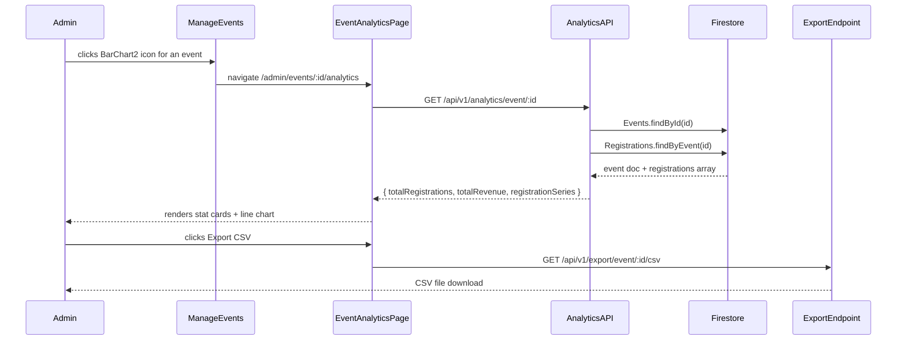

# Design Document: Event Analytics

## Overview

This feature adds a per-event analytics page (`/admin/events/:id/analytics`) to the EventFlex admin experience. It drills one level deeper than the existing AdminDashboard by scoping registrations data to a single event: two summary stat cards (Total Registrations, Total Revenue) and a day-by-day registrations line chart, plus an Export CSV button that reuses the existing export endpoint.

The implementation touches three layers:
- **Server**: one new controller function + one new route in the existing analytics router
- **Client API**: one new function in `analytics.api.js`
- **Client UI**: one new page component + one new route in AppRouter + one new icon-link in ManageEvents

No new dependencies are required. recharts, @tanstack/react-query, lucide-react, and the existing Firestore helpers are all reused.

---

## Architecture



---

## Components and Interfaces

### New: `EventAnalyticsPage` (`client/src/pages/admin/EventAnalyticsPage.jsx`)

Renders the full analytics view for a single event. Uses `useQuery` to fetch from the new API endpoint.

States:
- **Loading**: renders `<Loader />`
- **Error**: renders `<ErrorState onRetry={refetch} />`
- **Empty series**: renders stat cards + empty state message in chart area
- **Data**: renders stat cards + `<LineChart />`

Props: none (reads `:id` from `useParams`)

### Modified: `ManageEvents` (`client/src/pages/admin/ManageEvents.jsx`)

Adds a `<Link>` with a `BarChart2` icon (lucide-react) to the Actions column for each event row, pointing to `/admin/events/${event._id}/analytics`.

### Modified: `AppRouter` (`client/src/routes/AppRouter.jsx`)

Adds the route:
```jsx
<Route path="events/:id/analytics" element={<EventAnalyticsPage />} />
```
inside the existing `/admin` route group.

### Modified: `analytics.api.js` (`client/src/api/analytics.api.js`)

Adds:
```js
export const getEventAnalyticsApi = (id) => api.get(`/analytics/event/${id}`);
```

### New: `getEventAnalytics` controller function (`server/controllers/analytics.controller.js`)

Handles `GET /api/v1/analytics/event/:id`. Logic:
1. Fetch event by ID — 404 if not found
2. Verify `event.createdBy === req.user._id` — 403 if not owner
3. Fetch all registrations for the event via `Registrations.findByEvent(id)`
4. Compute `totalRegistrations = registrations.length`
5. Compute `totalRevenue = sum of amount where paymentStatus === 'paid'`
6. Derive `registrationSeries` by grouping registrations by calendar date of `registeredAt`, counting per date, sorting ascending

### Modified: `analytics.routes.js` (`server/routes/analytics.routes.js`)

Adds:
```js
router.get('/event/:id', protect, authorize('admin'), getEventAnalytics);
```

---

## Data Models

No new collections or schema changes. The feature reads from existing Firestore collections.

### API Response Shape

`GET /api/v1/analytics/event/:id` — 200 OK:
```json
{
  "success": true,
  "message": "Event analytics fetched",
  "data": {
    "totalRegistrations": 42,
    "totalRevenue": 2100,
    "registrationSeries": [
      { "date": "2025-03-01", "count": 5 },
      { "date": "2025-03-02", "count": 12 },
      { "date": "2025-03-03", "count": 25 }
    ]
  }
}
```

### `registrationSeries` derivation

```
registrationSeries = registrations
  .map(r => toYYYYMMDD(r.registeredAt))   // extract calendar date
  .groupBy(date)                           // group by date string
  .map((date, regs) => ({ date, count: regs.length }))
  .sortBy(date, 'asc')                     // ascending chronological order
```

`toYYYYMMDD` extracts the `YYYY-MM-DD` portion from an ISO 8601 string (e.g. `"2025-03-01T14:30:00.000Z"` → `"2025-03-01"`).

---

## Correctness Properties

*A property is a characteristic or behavior that should hold true across all valid executions of a system — essentially, a formal statement about what the system should do. Properties serve as the bridge between human-readable specifications and machine-verifiable correctness guarantees.*

### Property 1: Analytics link present for every event

*For any* list of events rendered in ManageEvents, every event row SHALL contain a link to `/admin/events/:id/analytics` where `:id` matches that event's ID.

**Validates: Requirements 1.1**

### Property 2: Stat cards reflect API data

*For any* valid API response containing `totalRegistrations` and `totalRevenue`, the rendered page SHALL display those exact values — the registrations count in the "Total Registrations" card and the revenue prefixed with ₹ in the "Total Revenue" card.

**Validates: Requirements 2.1, 2.2**

### Property 3: Revenue is sum of paid amounts only

*For any* array of registration documents with varying `paymentStatus` and `amount` values, the computed `totalRevenue` SHALL equal the sum of `amount` for only those registrations where `paymentStatus === 'paid'`, and SHALL exclude all others.

**Validates: Requirements 2.2**

### Property 4: Registration series data points are well-formed

*For any* set of registrations passed to the series derivation function, every data point in the returned `registrationSeries` SHALL have a `date` field matching the `YYYY-MM-DD` format and a `count` that is a non-negative integer.

**Validates: Requirements 3.2, 5.5**

### Property 5: Registration series is sorted ascending

*For any* set of registrations with arbitrary `registeredAt` timestamps, the returned `registrationSeries` SHALL be sorted in ascending chronological order by `date`.

**Validates: Requirements 3.5**

### Property 6: Series grouping is correct

*For any* set of registrations, the `count` for each date in `registrationSeries` SHALL equal the number of registrations whose `registeredAt` field falls on that calendar date, and no date SHALL appear more than once in the series.

**Validates: Requirements 5.5**

### Property 7: API response always contains required fields

*For any* valid event owned by the requesting admin, the API response SHALL always contain `totalRegistrations`, `totalRevenue`, and `registrationSeries` fields, regardless of how many registrations exist (including zero).

**Validates: Requirements 5.2**

---

## Error Handling

| Scenario | Server behavior | Client behavior |
|---|---|---|
| Event not found | 404 `{ success: false, message: "Event not found" }` | `<ErrorState>` shown |
| Admin does not own event | 403 `{ success: false, message: "Forbidden" }` | `<ErrorState>` shown |
| Unauthenticated request | 401 from `protect` middleware | Redirect to login (existing behavior) |
| API request fails (network/5xx) | — | `<ErrorState onRetry={refetch} />` shown |
| Empty `registrationSeries` | Returns `[]` with 200 | Empty state message inside chart area |
| Export CSV endpoint error | Existing export endpoint handles | Toast notification: "Export failed" |

---

## Testing Strategy

This feature has both pure server-side logic (series derivation, revenue computation) and UI rendering. Property-based testing applies to the server-side transformation functions. UI behavior is covered by example-based tests.

**Property-based testing library**: [fast-check](https://github.com/dubzzz/fast-check) (already available in the JS ecosystem, works with Jest which is already configured in `server/jest.config.js`).

Each property test runs a minimum of 100 iterations.

### Server-side property tests (`server/tests/analytics.property.test.js`)

- **Property 3** — Revenue computation: generate arbitrary arrays of registration objects with random `paymentStatus` (`'paid'` | `'not_required'` | `'pending'`) and random `amount` values; assert computed revenue equals sum of paid amounts only.
  Tag: `Feature: event-analytics, Property 3: Revenue is sum of paid amounts only`

- **Property 4** — Series data point shape: generate random ISO timestamp arrays, derive series, assert every point has `date` matching `/^\d{4}-\d{2}-\d{2}$/` and `count >= 0`.
  Tag: `Feature: event-analytics, Property 4: Registration series data points are well-formed`

- **Property 5** — Series sort order: generate shuffled timestamp arrays, derive series, assert dates are in ascending order.
  Tag: `Feature: event-analytics, Property 5: Registration series is sorted ascending`

- **Property 6** — Series grouping correctness: generate registrations with known dates, derive series, assert each date's count matches the known input count and no date is duplicated.
  Tag: `Feature: event-analytics, Property 6: Series grouping is correct`

- **Property 7** — Response shape: generate random registration arrays (including empty), call the controller logic, assert all three fields are always present.
  Tag: `Feature: event-analytics, Property 7: API response always contains required fields`

### Client-side property tests (`client/src/__tests__/EventAnalyticsPage.property.test.jsx`)

- **Property 1** — Analytics link per event: generate random event arrays, render ManageEvents, assert each event has an analytics link.
  Tag: `Feature: event-analytics, Property 1: Analytics link present for every event`

- **Property 2** — Stat cards reflect API data: generate random `{ totalRegistrations, totalRevenue }` values, mock the API, render the page, assert both cards display the correct values with ₹ prefix on revenue.
  Tag: `Feature: event-analytics, Property 2: Stat cards reflect API data`

### Example-based unit tests

- Page renders loading state while API is in-flight
- Page renders `<ErrorState>` on API failure (including 403)
- Page renders empty state message when `registrationSeries` is `[]`
- Page renders line chart when `registrationSeries` is non-empty
- Stat cards appear before chart in DOM order
- Export CSV button is present
- Clicking Export CSV opens the correct endpoint URL
- API returns 404 for non-existent event ID
- API returns 403 when admin does not own the event
