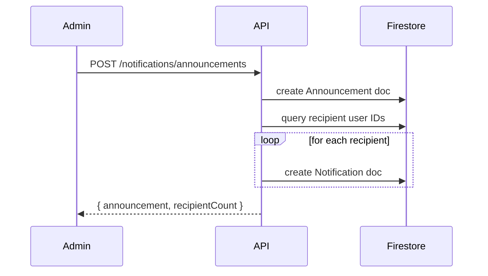

# Design Document: Notification / Announcement System

## Overview

The Notification / Announcement System adds in-app messaging to EventFlex. Admins compose announcements targeting either all students or registrants of a specific event. Each recipient gets an individual Notification record. Students see a bell icon in the Navbar with an unread badge, a dropdown of recent notifications, and a full Notification Center page. The Principal has a read-only view of all announcements for oversight. Delivery is on-demand via polling / refetch-on-focus — no WebSockets required.

The system integrates into the existing Firestore-backed architecture, following the same `db.js` helper pattern used by Events, Registrations, and AuditLogs.

---

## Architecture

```mermaid
graph TD
  subgraph Client
    NB[NotificationBell\nNavbar component]
    NC[NotificationCenter\n/student/notifications]
    AP[AnnouncementsPage\n/admin/announcements]
    PP[PrincipalAnnouncements\n/principal/announcements]
  end

  subgraph Server
    NR[/api/v1/notifications\nroutes]
    NC_ctrl[notification.controller]
    NS[Notifications\nFirestore helper]
    AN[Announcements\nFirestore helper]
  end

  subgraph Firestore
    notif_col[(notifications)]
    ann_col[(announcements)]
  end

  NB -->|GET /notifications/unread-count\nGET /notifications?limit=10| NR
  NC -->|GET /notifications\nPATCH /notifications/:id/read\nPATCH /notifications/read-all| NR
  AP -->|POST /notifications/announcements\nGET /notifications/announcements/mine\nDELETE /notifications/announcements/:id| NR
  PP -->|GET /notifications/announcements/all| NR

  NR --> NC_ctrl
  NC_ctrl --> NS
  NC_ctrl --> AN
  NS --> notif_col
  AN --> ann_col
```

**Data flow for sending an announcement:**



---

## Components and Interfaces

### Backend

#### Routes — `POST /api/v1/notifications`

| Method | Path | Auth | Description |
|--------|------|------|-------------|
| POST | `/announcements` | admin | Create & send announcement |
| GET | `/announcements/mine` | admin | Admin's announcement history |
| GET | `/announcements/all` | principal | All announcements (read-only) |
| DELETE | `/announcements/:id` | admin | Delete announcement + notifications |
| GET | `/` | student | Paginated notifications for current student |
| GET | `/unread-count` | student | Unread count for bell badge |
| PATCH | `/:id/read` | student | Mark single notification as read |
| PATCH | `/read-all` | student | Mark all as read |

#### `notification.controller.js`

```
createAnnouncement(req, res)
  - validate title (1-100), message (1-1000), audienceType
  - if audienceType === 'event_registrants', require eventId
  - resolve recipient IDs (all students OR event registrants)
  - batch-create Notification docs
  - return { announcement, recipientCount }

getMyAnnouncements(req, res)
  - return Announcements where senderId === req.user._id, desc

getAllAnnouncements(req, res)  [principal]
  - return all Announcements with sender name populated, desc

deleteAnnouncement(req, res)
  - verify ownership (senderId === req.user._id)
  - delete all Notification docs with announcementId
  - delete Announcement doc

getMyNotifications(req, res)  [student]
  - paginated fetch of Notifications where recipientId === req.user._id, desc

getUnreadCount(req, res)  [student]
  - count Notifications where recipientId === req.user._id AND isRead === false

markAsRead(req, res)  [student]
  - verify recipientId === req.user._id, set isRead = true

markAllAsRead(req, res)  [student]
  - batch update all unread Notifications for req.user._id
```

### Frontend

#### `NotificationBell` (added to `Navbar.jsx`)

- Polls `GET /notifications/unread-count` on mount and on window focus (via `refetchOnWindowFocus: true` in React Query)
- Shows a red badge when `unreadCount > 0`
- On click: opens a dropdown, fetches `GET /notifications?limit=10`
- Each item shows: title, truncated preview (≤80 chars), relative time
- "View all" link navigates to `/student/notifications`

#### `NotificationCenter` — `/student/notifications`

- Full page listing all notifications, paginated (20/page)
- Unread items visually distinct (e.g. indigo left border + lighter background)
- Click to mark as read inline
- "Mark all as read" button at top

#### `AnnouncementsPage` — `/admin/announcements`

- Form: title input, message textarea, audience radio (`all_students` / `event_registrants`), event selector (shown when `event_registrants` selected)
- History table: title, audience, event (if any), recipient count, date, delete button
- Delete triggers a confirmation modal before API call

#### `PrincipalAnnouncements` — `/principal/announcements`

- Read-only table: title, sender name, audience, recipient count, date
- No create/edit/delete controls

#### `notification.api.js`

```js
createAnnouncement(data)          // POST /notifications/announcements
getMyAnnouncements()              // GET  /notifications/announcements/mine
getAllAnnouncements()             // GET  /notifications/announcements/all
deleteAnnouncement(id)            // DELETE /notifications/announcements/:id
getMyNotifications(params)        // GET  /notifications
getUnreadCount()                  // GET  /notifications/unread-count
markAsRead(id)                    // PATCH /notifications/:id/read
markAllAsRead()                   // PATCH /notifications/read-all
```

---

## Data Models

### Firestore Collection: `announcements`

```
{
  _id:           string          // Firestore doc ID
  senderId:      string          // User._id of the admin
  senderName:    string          // Denormalized for principal view
  title:         string          // 1–100 chars
  message:       string          // 1–1000 chars
  audienceType:  'all_students' | 'event_registrants'
  eventId:       string | null   // required when audienceType === 'event_registrants'
  eventTitle:    string | null   // denormalized event title
  recipientCount: number
  createdAt:     ISO string
}
```

### Firestore Collection: `notifications`

```
{
  _id:            string         // Firestore doc ID
  announcementId: string         // ref to announcements doc
  recipientId:    string         // User._id of the student
  senderId:       string         // User._id of the admin
  title:          string
  message:        string
  isRead:         boolean        // default false
  audienceType:   'all_students' | 'event_registrants'
  eventId:        string | null  // null if event deleted
  createdAt:      ISO string
}
```

**Design decisions:**
- `senderName` and `eventTitle` are denormalized on the announcement to avoid extra lookups in the principal/admin list views.
- `announcementId` on each notification enables efficient cascade delete without a join.
- `eventId` is set to `null` (not removed) when the referenced event is deleted, preserving the notification record.
- No separate `updatedAt` on notifications — only `isRead` changes after creation, tracked by the field itself.

### Firestore Helper additions to `db.js`

```js
Announcements: {
  create(data),
  findBySender(senderId, { limit, offset }),
  findAll({ limit, offset }),
  findById(id),
  delete(id),
}

Notifications: {
  create(data),
  createBatch(dataArray),          // batch write for fan-out
  findByRecipient(recipientId, { limit, offset }),
  countUnread(recipientId),
  markRead(id),
  markAllRead(recipientId),
  deleteByAnnouncement(announcementId),
  nullifyEventId(eventId),         // called when an event is deleted
}
```

---

## Correctness Properties

*A property is a characteristic or behavior that should hold true across all valid executions of a system — essentially, a formal statement about what the system should do. Properties serve as the bridge between human-readable specifications and machine-verifiable correctness guarantees.*

### Property 1: Announcement fan-out completeness

*For any* valid announcement sent to a given audience, the number of Notification records created in Firestore must equal the number of users in that audience at the time of sending.

**Validates: Requirements 1.6**

---

### Property 2: Notification field completeness

*For any* created Notification record, retrieving it must return all required fields — `recipientId`, `senderId`, `title`, `message`, `isRead`, `audienceType`, `eventId`, and `createdAt` — with values matching the originating announcement.

**Validates: Requirements 1.7, 3.1**

---

### Property 3: Input validation rejects out-of-range inputs

*For any* announcement submission where the title is empty, whitespace-only, or exceeds 100 characters, or where the message body is empty, whitespace-only, or exceeds 1000 characters, the service must reject the request with a 4xx error and must not persist any records.

**Validates: Requirements 1.2, 1.3**

---

### Property 4: Unread count accuracy

*For any* student and any set of their notification records, the value returned by `getUnreadCount` must equal the count of records in that set where `isRead === false`.

**Validates: Requirements 2.1, 2.2**

---

### Property 5: Notification ordering invariant

*For any* paginated response from `getMyNotifications` or any announcements list endpoint, each item's `createdAt` must be greater than or equal to the `createdAt` of the next item (descending order).

**Validates: Requirements 2.4, 4.1, 5.1**

---

### Property 6: Mark-as-read transition

*For any* unread notification belonging to a student, after calling `markAsRead` or `markAllAsRead`, all targeted notifications must have `isRead === true` and the unread count for that student must reflect the change.

**Validates: Requirements 2.6, 2.7**

---

### Property 7: Cascade delete completeness

*For any* announcement with associated notification records, after the announcement is deleted, querying notifications by `announcementId` must return an empty result set.

**Validates: Requirements 4.4**

---

### Property 8: Recipient data isolation

*For any* two distinct students A and B, the notifications returned for student A must all have `recipientId === A._id`, and student A must receive a 403 when attempting to access student B's notifications directly.

**Validates: Requirements 6.2, 6.4**

---

### Property 9: Announcement data completeness

*For any* announcement in the admin history or principal list response, the response object must contain `title`, `audienceType`, `recipientCount`, and `createdAt`. The principal view must additionally include `senderName`.

**Validates: Requirements 4.2, 5.2**

---

### Property 10: Event deletion preserves notifications

*For any* notification that references an `eventId`, after that event is deleted, the notification record must still exist and its `eventId` field must be `null`.

**Validates: Requirements 3.3**

---

## Error Handling

| Scenario | HTTP Status | Response |
|----------|-------------|----------|
| Missing/invalid auth token | 401 | `{ success: false, message: "No token provided" }` |
| Non-admin attempts to create announcement | 403 | `{ success: false, message: "Forbidden: insufficient role" }` |
| Student accesses another student's notifications | 403 | `{ success: false, message: "Forbidden" }` |
| Title empty or > 100 chars | 422 | `{ success: false, message: "Title must be 1–100 characters" }` |
| Message empty or > 1000 chars | 422 | `{ success: false, message: "Message must be 1–1000 characters" }` |
| `event_registrants` audience with no eventId | 422 | `{ success: false, message: "Event is required for event_registrants audience" }` |
| Referenced event not found | 404 | `{ success: false, message: "Event not found" }` |
| Announcement not found on delete | 404 | `{ success: false, message: "Announcement not found" }` |
| Admin deletes another admin's announcement | 403 | `{ success: false, message: "Forbidden: not the owner" }` |
| Notification not found on mark-read | 404 | `{ success: false, message: "Notification not found" }` |

**Client-side error handling:**
- All mutations use `onError` callbacks to call `toast.error(err.response?.data?.message)`, consistent with existing pages.
- The announcement form shows inline field-level errors for validation failures.
- The delete confirmation modal prevents accidental deletion; the delete button shows a loading spinner during the mutation.

---

## Testing Strategy

### Unit Tests (example-based)

- `notification.controller` — test each handler with mocked Firestore helpers:
  - `createAnnouncement` with valid `all_students` payload
  - `createAnnouncement` with valid `event_registrants` payload
  - `createAnnouncement` with missing title (expect 422)
  - `deleteAnnouncement` by non-owner (expect 403)
  - `markAsRead` for a notification belonging to a different student (expect 403)
  - `getUnreadCount` returns 0 when all notifications are read
- `NotificationBell` component — renders badge when unreadCount > 0, no badge when 0
- `AnnouncementsPage` — confirmation modal appears before delete executes
- `PrincipalAnnouncements` — no create/edit/delete buttons rendered

### Property-Based Tests

Using **fast-check** (already compatible with the Vite/Jest setup).

Each property test runs a minimum of **100 iterations**.

Tag format: `Feature: notification-announcement-system, Property {N}: {property_text}`

- **Property 1** — Generate random audience sizes; verify `notifications.length === recipientCount`
- **Property 2** — Generate random announcement payloads; verify all required fields present on each notification
- **Property 3** — Generate strings of length 0, 1–100, 101–500 for title and 0, 1–1000, 1001–2000 for body; verify accept/reject boundary
- **Property 4** — Generate random arrays of notifications with mixed `isRead` values; verify `countUnread` equals `filter(n => !n.isRead).length`
- **Property 5** — Generate random notification/announcement arrays; verify sorted order invariant holds on every adjacent pair
- **Property 6** — Generate random sets of unread notifications; after `markAllAsRead`, verify all have `isRead === true` and count is 0
- **Property 7** — Generate announcement + notifications; after delete, verify notifications query returns empty
- **Property 8** — Generate two distinct student IDs; verify all returned notifications have correct `recipientId`
- **Property 9** — Generate random announcements; verify required fields present in both admin and principal responses
- **Property 10** — Generate notifications with eventId; after event deletion, verify notification exists with `eventId === null`

### Integration Tests

- End-to-end: create announcement → fetch student notifications → verify records exist in Firestore
- Access control: unauthenticated request to `POST /announcements` returns 403
- Cascade delete: create announcement, delete it, verify both `announcements` and `notifications` collections are clean
