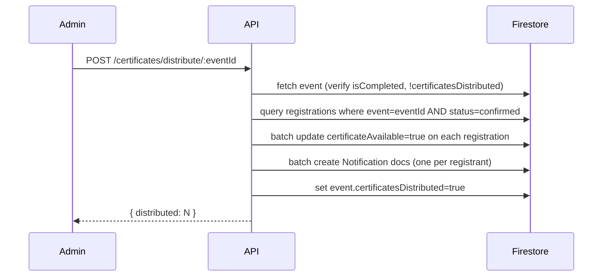
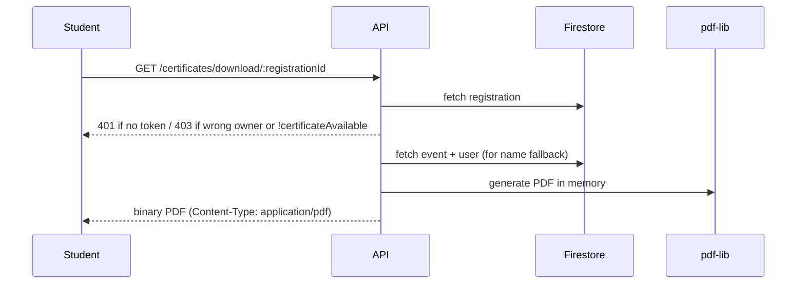

# Design Document: Participation Certificate

## Overview

The Participation Certificate feature lets admins mark events as completed and distribute PDF certificates to all confirmed registrants. Certificates are generated on-demand server-side using **pdf-lib** — no files are stored. Students download their certificate from the My Registrations page via a "Download Certificate" button that appears once the admin has distributed certificates for that event.

The feature touches three layers:

1. **Data** — two new fields on existing Firestore documents (`isCompleted` + `completedAt` on events; `certificateAvailable` on registrations)
2. **Backend** — three new API endpoints (mark complete, distribute, download) plus a `certificate.controller.js`
3. **Frontend** — additions to `ManageEvents.jsx` (admin actions) and `MyRegistrations.jsx` (student download button)

Notifications are delivered via the parallel notification-announcement-system spec; this feature calls into that system's `Notifications.createBatch` helper.

---

## Architecture

```mermaid
graph TD
  subgraph Client
    ME[ManageEvents\n/admin/events]
    MR[MyRegistrations\n/student/registrations]
  end

  subgraph Server
    ER[/api/v1/events/:id/complete\nPATCH]
    DR[/api/v1/certificates/distribute/:eventId\nPOST]
    DL[/api/v1/certificates/download/:registrationId\nGET]
    CC[certificate.controller.js]
    EC[event.controller.js]
    PDFLIB[pdf-lib]
    NS[Notifications helper\nfrom notification spec]
  end

  subgraph Firestore
    EV[(events)]
    REG[(registrations)]
    NOTIF[(notifications)]
  end

  ME -->|PATCH /events/:id/complete| ER
  ME -->|POST /certificates/distribute/:eventId| DR
  MR -->|GET /certificates/download/:registrationId| DL

  ER --> EC --> EV
  DR --> CC
  DL --> CC

  CC --> REG
  CC --> EV
  CC --> PDFLIB
  CC --> NS --> NOTIF
```

**Request flow — distribute certificates:**



**Request flow — download certificate:**



---

## Components and Interfaces

### Backend

#### New route file — `server/routes/certificate.routes.js`

| Method | Path | Auth | Description |
|--------|------|------|-------------|
| PATCH | `/api/v1/events/:id/complete` | admin | Mark event as completed |
| POST | `/api/v1/certificates/distribute/:eventId` | admin | Distribute certificates to confirmed registrants |
| GET | `/api/v1/certificates/download/:registrationId` | student | Download own PDF certificate |

The complete and distribute routes are protected by `protect` + `authorize('admin')`. The download route is protected by `protect` only (ownership check is done inside the controller).

#### `server/controllers/certificate.controller.js`

```
distributecertificates(req, res)
  - fetch event by req.params.eventId
  - 404 if not found
  - 400 if !event.isCompleted
  - 409 if event.certificatesDistributed === true
  - fetch registrations where event=eventId AND status='confirmed'
  - if none: return 200 with message "No eligible registrants"
  - batch update: set certificateAvailable=true on each registration
  - build notification payloads (one per registration)
  - call Notifications.createBatch(notificationPayloads)
  - update event: set certificatesDistributed=true
  - return { distributed: count }

downloadCertificate(req, res)
  - fetch registration by req.params.registrationId
  - 404 if not found
  - 403 if registration.student !== req.user._id
  - 403 if !registration.certificateAvailable
  - fetch event by registration.event
  - fetch user by registration.student (for name fallback)
  - resolve name: registration.participantDetails?.name || user.name
  - generate PDF with pdf-lib (landscape A4, 842×595 pt)
  - set headers: Content-Type: application/pdf, Content-Disposition: attachment; filename="certificate.pdf"
  - res.end(pdfBytes)
```

#### `markEventComplete` added to `server/controllers/event.controller.js`

```
markEventComplete(req, res)
  - fetch event by req.params.id
  - 404 if not found
  - 403 if event.createdBy !== req.user._id
  - 400 if event.isCompleted === true
  - update event: isCompleted=true, completedAt=now
  - return { event: updated }
```

#### PDF generation helper — `server/utils/generateCertificate.js`

```
generateCertificate({ participantName, eventName, eventDate }) → Uint8Array
  - create new PDFDocument with landscape A4 page (842×595 pt)
  - embed StandardFonts.HelveticaBold and Helvetica
  - draw decorative border rectangle
  - draw title text "Certificate of Participation"
  - draw "This is to certify that"
  - draw participantName (large, bold)
  - draw "has successfully participated in"
  - draw eventName (medium, bold)
  - draw "held on " + formatted eventDate
  - return pdfDoc.save()
```

#### Additions to `server/models/db.js`

```js
// Events additions
Events.markComplete(id)           // sets isCompleted=true, completedAt=ISO string
Events.setCertificatesDistributed(id)  // sets certificatesDistributed=true

// Registrations additions
Registrations.findConfirmedByEvent(eventId)   // where event=eventId AND status='confirmed'
Registrations.setCertificateAvailable(ids)    // batch update certificateAvailable=true
```

### Frontend

#### `client/src/api/certificate.api.js` (new file)

```js
distributeApi(eventId)          // POST /certificates/distribute/:eventId
downloadCertificateApi(registrationId)  // GET /certificates/download/:registrationId — returns blob
```

#### `ManageEvents.jsx` changes

- Add `markCompleteApi` call via `useMutation`; on success invalidate `['admin-events']`
- Add "Mark as Completed" button in the Actions column — visible when `!event.isCompleted && !event.isCancelled && event.isPublished`
- Add "Completed" status badge in the Status column when `event.isCompleted`
- Disable Edit and Toggle Publish buttons when `event.isCompleted`
- Add "Distribute Certificates" button — visible when `event.isCompleted && !event.certificatesDistributed`
- Show disabled "Certificates Distributed" badge when `event.certificatesDistributed`
- Confirmation modal before calling distribute (reuse existing `Modal` component)

#### `MyRegistrations.jsx` changes

- Add "Download Certificate" button on registration cards where `reg.certificateAvailable && reg.status === 'confirmed'`
- On click: call `downloadCertificateApi(reg._id)`, receive blob, create object URL, trigger `<a download>` click, revoke URL

---

## Data Models

### Event document — new fields

```js
isCompleted:             Boolean   // default: false
completedAt:             String    // ISO timestamp, set when isCompleted becomes true
certificatesDistributed: Boolean   // default: false, set after distribute runs
```

### Registration document — new field

```js
certificateAvailable: Boolean   // default: false, set to true during distribution
```

No schema migrations are needed — Firestore is schemaless and the `db.js` helpers use spread defaults. Existing documents without these fields will read as `undefined`, which is falsy and handled correctly by all conditional checks.

---

## Correctness Properties

*A property is a characteristic or behavior that should hold true across all valid executions of a system — essentially, a formal statement about what the system should do. Properties serve as the bridge between human-readable specifications and machine-verifiable correctness guarantees.*

### Property 1: Mark-complete is a one-way transition

*For any* event that has `isCompleted === true`, calling the mark-complete endpoint again must return a 4xx error and must not modify the event's `completedAt` timestamp.

**Validates: Requirements 1.4**

---

### Property 2: Distribution targets only confirmed registrations

*For any* event with a mix of `confirmed`, `pending`, and `cancelled` registrations, after calling distribute, `certificateAvailable` must be `true` on every confirmed registration and `false` (or absent) on every non-confirmed registration.

**Validates: Requirements 2.3**

---

### Property 3: Notification fan-out matches confirmed registrant count

*For any* event with N confirmed registrants, after a successful distribute call, exactly N notification records must be created — one per confirmed registrant, with no duplicates.

**Validates: Requirements 2.4, 5.4**

---

### Property 4: Distribution is idempotency-guarded

*For any* event where `certificatesDistributed === true`, calling distribute again must return a 4xx error and must not create additional notification records or modify any registration records.

**Validates: Requirements 2.6**

---

### Property 5: Certificate download button visibility invariant

*For any* registration record rendered in My Registrations, the "Download Certificate" button must appear if and only if `certificateAvailable === true` AND `status === 'confirmed'`.

**Validates: Requirements 3.1**

---

### Property 6: Generated PDF contains required content fields

*For any* combination of participant name, event name, and event date, the PDF bytes produced by `generateCertificate` must contain all three values as readable text within the document.

**Validates: Requirements 3.2, 4.1**

---

### Property 7: Generated PDF is landscape A4

*For any* call to `generateCertificate`, the resulting PDF must have exactly one page with width 842 pt and height 595 pt.

**Validates: Requirements 4.2**

---

### Property 8: Generated PDF is a valid PDF document

*For any* call to `generateCertificate`, the returned bytes must begin with the `%PDF-` magic header, indicating a well-formed PDF file.

**Validates: Requirements 4.5**

---

### Property 9: Ownership and availability gate on download

*For any* download request where either the authenticated user's ID does not match `registration.student` or `registration.certificateAvailable` is not `true`, the endpoint must return HTTP 403 and must not invoke the PDF generation function.

**Validates: Requirements 3.5, 3.6, 6.2**

---

### Property 10: Notification content correctness

*For any* event name, every notification created during certificate distribution must have `title === "Certificate Available"` and a `message` string that contains the event name.

**Validates: Requirements 5.2**

---

## Error Handling

| Scenario | HTTP Status | Response message |
|----------|-------------|-----------------|
| No auth token on any certificate endpoint | 401 | `"No token provided"` |
| Non-admin calls distribute | 403 | `"Forbidden: insufficient role"` |
| Student calls distribute | 403 | `"Forbidden: insufficient role"` |
| Event not found (complete / distribute) | 404 | `"Event not found"` |
| Event not yet completed (distribute) | 400 | `"Event must be marked as completed before distributing certificates"` |
| Event already completed (mark-complete) | 400 | `"Event is already marked as completed"` |
| Certificates already distributed | 409 | `"Certificates have already been distributed for this event"` |
| No confirmed registrants | 200 | `"No eligible registrants found"` (no-op, not an error) |
| Registration not found (download) | 404 | `"Registration not found"` |
| Wrong owner on download | 403 | `"Forbidden"` |
| Certificate not available on download | 403 | `"Certificate is not available for this registration"` |
| PDF generation failure | 500 | `"Failed to generate certificate"` |

**Client-side:**
- All mutations use `onError: (err) => toast.error(err.response?.data?.message)` consistent with existing pages.
- The distribute button shows a loading spinner (`isPending`) during the mutation.
- The download button shows a loading state while the blob is being fetched.
- The confirmation modal uses the existing `Modal` component.

---

## Testing Strategy

### Unit Tests (example-based)

- `generateCertificate` utility:
  - Returns bytes starting with `%PDF-`
  - Returned buffer is non-empty
  - Falls back to `user.name` when `participantDetails.name` is absent
- `certificate.controller.distributecertificates`:
  - Returns 400 when event is not completed
  - Returns 409 when certificates already distributed
  - Returns 200 with "No eligible registrants" message when none exist
  - Returns 403 when called without admin role
- `certificate.controller.downloadCertificate`:
  - Returns 403 when `certificateAvailable` is false
  - Returns 403 when student ID does not match registration owner
  - Returns 401 when no token is provided
  - Returns correct `Content-Type` and `Content-Disposition` headers on success
- `event.controller.markEventComplete`:
  - Returns 400 when event is already completed
  - Returns 403 when caller is not the event creator
- `ManageEvents` component:
  - "Mark as Completed" button visible for published, non-cancelled, non-completed events
  - Edit and Toggle Publish buttons disabled for completed events
  - "Distribute Certificates" button visible only when `isCompleted && !certificatesDistributed`
- `MyRegistrations` component:
  - "Download Certificate" button visible only when `certificateAvailable && status === 'confirmed'`

### Property-Based Tests

Using **fast-check** (consistent with the notification-announcement-system spec).

Each property test runs a minimum of **100 iterations**.

Tag format: `Feature: participation-certificate, Property {N}: {property_text}`

- **Property 1** — Generate random completed events; verify mark-complete returns 4xx and completedAt is unchanged
- **Property 2** — Generate random registration arrays with mixed statuses; after distribute, verify certificateAvailable is set only on confirmed ones
- **Property 3** — Generate random counts of confirmed registrants (0–50); verify notification count equals confirmed count
- **Property 4** — Generate events with certificatesDistributed=true; verify distribute returns 4xx and no new notifications are created
- **Property 5** — Generate random registration objects with all combinations of certificateAvailable and status; verify button visibility matches the conjunction condition
- **Property 6** — Generate random participant names, event names, and dates; verify all three appear in the generated PDF bytes (as UTF-8 strings)
- **Property 7** — Generate any valid certificate input; parse the resulting PDF and verify page dimensions are 842×595
- **Property 8** — Generate any valid certificate input; verify output bytes start with `%PDF-`
- **Property 9** — Generate mismatched user/registration pairs and registrations with certificateAvailable=false; verify 403 is returned and PDF generation is not called
- **Property 10** — Generate random event names; verify every notification created has the correct title and message containing the event name

### Integration Tests

- End-to-end: mark event complete → distribute → student downloads PDF → verify PDF is valid
- Access control: unauthenticated download request returns 401
- Access control: student downloading another student's certificate returns 403
- Idempotency: distribute twice on same event returns 409 on second call
